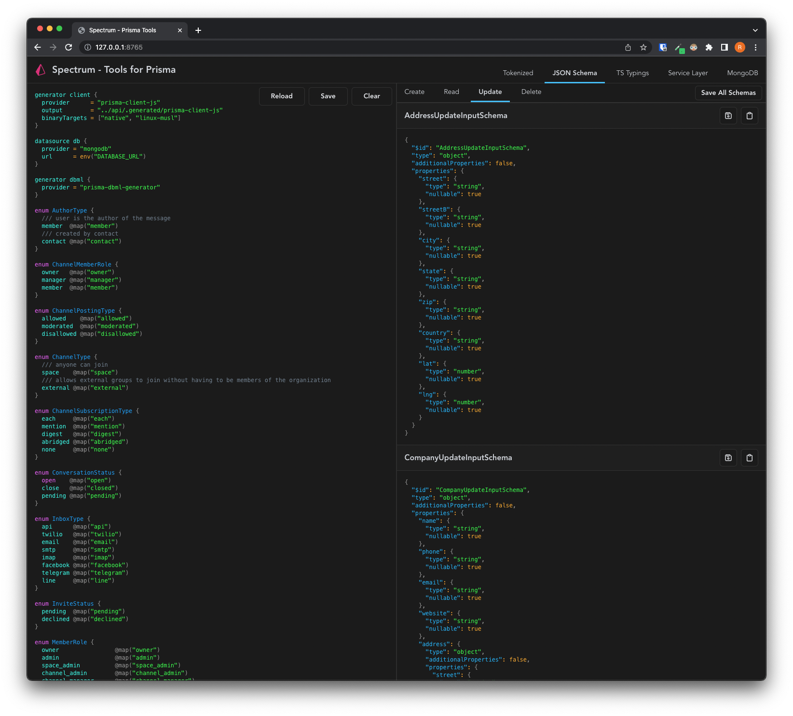
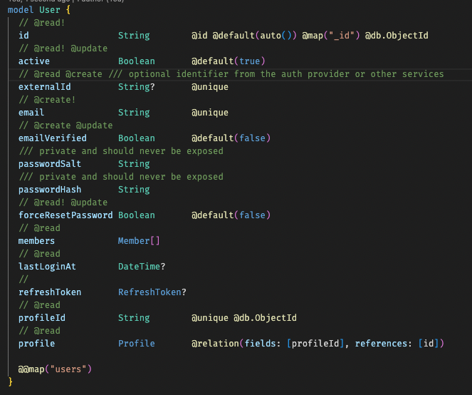

# Spectrum

Prisma is a popular open source ORM for creating data models in a human-readable format and producing Type-Safe queries in Node.js. Learn more https://prisma.io.

> Spectrum is currently in development. It is being used in some internal projects to test DX and issues. It is considered experimental and should not be used for production projects at this time.

## What is Spectrum

Spectrum is set of development tools to aid in faster development and integration using Prisma as the single source of truth.

Spectrum parses the `.prisma` files into tokenized objects that can then be transform into different formats. In addition, Spectrum provides special `comment decorators` that can be added to the `.prisma` file to further enhance the outputs.

**Example of using decorators**

## Generators

Spectrum provides a range of generators that will format prisma files into various files for consumption by your services in Node.js.

### Tokenizer

This is a JSON object representation of a `*.prisma` file. It also includes Spectrum decorators as part of the JSON object that is utilized by other generators.

### JSON Schema

JSON Schema is a vocabulary that allows you to annotate and validate JSON documents. It is agnostic to front or back end clients and has become one of the foundations for generating Type Definitions for TypeScript.

### TypScript Typings

Generated typings using Prisma models and Spectrum decorators.

### Service Layer

Stubbed TypeScript that encapsulates the Prisma client and leverages the TypeScript typings as a launchpad for generating the business logic for your services.

## TODO

These are currently at the forefront of development before additional Roadmap items are considered.

- [ ] Documentation
- [ ] Use Deno or Go as API service layer 
- [ ] Provide better navigation and UI support for web client
- [ ] UI/UX improvements - Smaller screen support.

## Roadmap

### CLI

Provide a CLI to quickly perform operations without use of web client.

### VS Code extension

Provide an extension to allow quick use of Spectrum without a need for service web client.

### MongoDB indexes

A script that will provide all the indexes that are needed in order to have your database optimized against the Prisma models.

### Database converter

Convert prisma files from one database to another. This is great for projects that are database agnostic.
